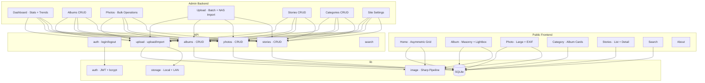

<div align="center">

# Afterimage

### The Afterimage of Light — A Minimalist Photography Portfolio Built for Photographers

[](https://nextjs.org/)
[](https://react.dev/)
[](https://www.typescriptlang.org/)
[](https://www.prisma.io/)
[]()

</div>

---

## What is this

Afterimage is a photography portfolio and management system. It doesn't try to do everything — it does two things well: **presents work beautifully to the audience, and helps photographers manage it efficiently.**

The public frontend is a Swiss Minimalism gallery — warm paper-white background, asymmetric grid, serif italic accents, subtle paper noise texture. The admin backend is a complete content management tool — batch upload, NAS import, analytics, story editor.

In short: **the frontend is a gallery, the backend is a workbench.**

---

## Highlights

### Asymmetric Grid — Beyond Cookie-Cutter Masonry

Most photography sites use equal-width masonry layouts, compressing every photo to the same size and losing all rhythm. Afterimage uses a 12-column grid with 7 cycling aspect ratios, letting each photo find its own place — vertical compositions breathe, horizontal ones expand, square ones anchor.

### Fullscreen Lightbox — Keyboard-Driven Browsing

Click any photo to enter a fullscreen lightbox with full keyboard control: `←` `→` to navigate, `Esc` to close, `i` to toggle the EXIF panel. The bottom info bar shows the current index and total count, while the EXIF panel displays camera, lens, aperture, shutter, ISO, focal length, and capture time — so viewers can understand how each shot was made.

### NAS LAN Import — Use Internal Network Storage as Data Source, Zero Server Bloat

If your server can reach an internal NAS, mount it as the image data source into the container. Afterimage scans LAN directories, recursively finds image files, and batch-imports selected items. During import, Sharp automatically generates thumbnails and optimized images while extracting EXIF — **from NAS to live in three steps: scan → select → import.**

Two import modes:
- **Copy to local**: Copy files to the server, managed independently
- **Reference only**: Record the NAS path without copying — originals stay on NAS, server only stores thumbnails and optimized images, drastically reducing server storage

### Photo Stories — Not Just a Gallery, a Creative Journal

Every photo has a story behind it. Afterimage includes a story/blog system with Markdown content, excerpts, cover photos, and linked albums. Photographers can write creative notes for a trip, a portrait session, a street shoot — letting the audience see not just the final image, but the creative process.

### Analytics — Know What Gets Seen

The admin dashboard provides a 30-day traffic trend chart, top 5 popular photos, and album view rankings. Not a complex analytics tool, but enough to answer one question: **what does the audience love most?**

### Swiss Minimalism Design Language

| Element | Choice | Rationale |
|---------|--------|-----------|
| Background | Warm paper white `#f4f2ed` | Not cold pure white, but a paper-warm off-white |
| Text | Near-black `#0e0e0e` | Softer than pure black, reduces contrast fatigue |
| Accent | Ochre `#a64b2a` | Used sparingly for key accents only |
| Heading font | Space Grotesk | Geometric sans-serif, modern and restrained |
| Accent font | Instrument Serif Italic | For subtitles and numbers, creating visual rhythm |
| Texture | SVG fractalNoise (2.5%) | Simulates printed paper feel on screen |
| Animation | cubic-bezier(0.22, 1, 0.36, 1) | Gentle deceleration curve |

### Zero External Dependencies — One-Command Docker Deploy

No MySQL, no Redis, no object storage required. SQLite single-file database + local image storage. `docker compose up -d` and it's running. Data persists through Docker volumes — migration is just copying two directories.

---

## Tech Stack

| Layer | Technology |
|-------|-----------|
| Framework | Next.js 15 (App Router) + React 19 + TypeScript |
| Database | Prisma 7 + SQLite (better-sqlite3) |
| Image Processing | Sharp (thumbnails / optimized / EXIF extraction) |
| Auth | JWT (jose) + bcryptjs + HttpOnly Cookie |
| Styling | Tailwind CSS 3 |
| Fonts | Space Grotesk + Instrument Serif |
| Testing | Vitest + Testing Library |
| Deploy | Docker multi-stage build, Node.js 22 runtime |

---

## Quick Start

### Docker (Recommended)

```bash
git clone <repo-url> afterimage && cd afterimage
cp .env.example .env    # Edit .env to set JWT_SECRET and admin credentials
docker compose up -d
```

Database migration and seeding run automatically on startup. Visit http://localhost:3000 (public) or http://localhost:3000/admin/login (admin).

**.env configuration:**

```env
DATABASE_URL="file:./data/afterimage.db"
JWT_SECRET="your-random-secret (32+ chars recommended)"
ADMIN_USERNAME="admin"
ADMIN_PASSWORD="your-password"           # plaintext, auto-hashed with bcrypt on seed
```

**Mount NAS (LAN import):** Uncomment the NAS volume mount in `docker-compose.yml` and point it to your NAS path:

```yaml
volumes:
  - afterimage-data:/app/data
  - afterimage-uploads:/app/public/uploads
  - /mnt/nas/photos:/mnt/nas:ro    # ← Change to your NAS mount path
```

### Local Development

```bash
npm install
cp .env.example .env
npx prisma migrate deploy
npx prisma db seed
npm run dev
```

---

## Project Structure



---

## Roadmap

- [ ] RAW format support (.CR3 / .NEF / .ARW)
- [ ] EXIF map view (GPS coordinates → map markers)
- [ ] Dark mode
- [ ] Multi-user collaboration
- [ ] S3 / R2 object storage backend

---

## License

Private — All Rights Reserved
