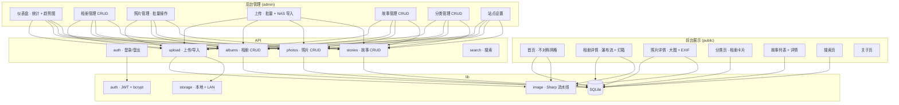

<div align="center">

# Afterimage

### 光影的残像 — 为摄影师而生的极简作品集系统

[](https://nextjs.org/)
[](https://react.dev/)
[](https://www.typescriptlang.org/)
[](https://www.prisma.io/)
[]()

</div>

---

## 这是什么

Afterimage 是一个摄影作品展示与管理系统。它不追求大而全，只做两件事：**让作品以最美的方式被看见，让摄影师高效地管理它们。**

前台是 Swiss Minimalism 风格的展示画廊——暖纸白底、不对称网格、衬线斜体点缀、纸张噪点纹理。后台是完整的内容管理工具——批量上传、NAS 导入、浏览统计、故事编辑。

一句话：**前台是美术馆，后台是工作台。**

---

## 亮点

### 不对称网格 — 告别千篇一律的瀑布流

大多数摄影网站用等宽瀑布流排列照片，所有作品被压缩成同样大小，失去了节奏感。Afterimage 用 12 列网格配合 7 种宽高比循环排列，让每张照片在页面中找到自己的位置——竖构图有呼吸感，横构图有展开感，方构图有稳定感。

### 全屏灯箱 — 键盘流浏览体验

点击任意照片进入全屏灯箱，全程键盘操作：`←` `→` 切换，`Esc` 退出，`i` 展开/收起 EXIF 信息面板。底部信息条显示当前序号与总数，EXIF 面板展示相机、镜头、光圈、快门、ISO、焦距、拍摄时间——观众可以了解每张照片是怎么拍出来的。

### NAS 局域网导入 — 用内网存储当数据源，服务器零膨胀

如果你的服务器能触达内网 NAS，可以把它作为图片数据源挂载到容器里。Afterimage 支持扫描局域网目录，递归查找图片文件，勾选后批量导入。导入时自动调用 Sharp 生成缩略图和优化图、提取 EXIF——**从 NAS 到上线，只需要扫描 → 勾选 → 导入三步。**

支持两种导入模式：
- **复制到本地**：复制文件到服务器，独立管理
- **直接引用**：只记录 NAS 路径，不复制文件——原图留在 NAS 上，服务器只存缩略图和优化图，大幅节省服务器存储空间

### 照片故事 — 不只是图库，也是创作日志

每张照片背后都有故事。Afterimage 内置故事/博客系统，支持 Markdown 正文、摘要、封面照片、关联相册。摄影师可以为一次旅行、一组人像、一场街拍写下创作笔记，让观众看到的不仅是最终成片，还有创作过程。

### 浏览统计 — 知道哪些作品被看见

后台仪表盘提供近 30 天浏览量趋势图、热门照片 Top 5、相册浏览量排行。不是复杂的分析工具，但足够回答一个问题：**观众最喜欢看什么？**

### Swiss Minimalism 设计语言

| 元素 | 选择 | 理由 |
|------|------|------|
| 底色 | 暖纸白 `#f4f2ed` | 不是冷冰冰的纯白，而是带有纸张温度的米白 |
| 文字 | 近黑 `#0e0e0e` | 比纯黑柔和，减少高对比疲劳 |
| 点缀 | 赭石 `#a64b2a` | 仅用于关键 accent，不喧宾夺主 |
| 标题字体 | Space Grotesk | 几何感无衬线，现代而克制 |
| 点缀字体 | Instrument Serif Italic | 衬线斜体用于副标题与数字，制造视觉韵律 |
| 纹理 | SVG fractalNoise (2.5%) | 模拟印刷品质感，让屏幕有触感 |
| 动画 | cubic-bezier(0.22, 1, 0.36, 1) | 柔和减速曲线，不急不躁 |

### 零外部依赖 — Docker 一键启动

不需要 MySQL，不需要 Redis，不需要对象存储。SQLite 单文件数据库 + 本地图片存储，`docker compose up -d` 就能跑起来。数据通过 Docker volume 持久化，迁移只需拷贝两个目录。

---

## 技术栈

| 层 | 技术 |
|----|------|
| 框架 | Next.js 15 (App Router) + React 19 + TypeScript |
| 数据库 | Prisma 7 + SQLite (better-sqlite3) |
| 图片处理 | Sharp（缩略图 / 优化图 / EXIF 提取） |
| 认证 | JWT (jose) + bcryptjs + HttpOnly Cookie |
| 样式 | Tailwind CSS 3 |
| 字体 | Space Grotesk + Instrument Serif |
| 测试 | Vitest + Testing Library |
| 部署 | Docker 多阶段构建，Node.js 22 运行时 |

---

## 快速开始

### Docker 部署（推荐）

```bash
git clone <repo-url> afterimage && cd afterimage
cp .env.example .env    # 编辑 .env，设置 JWT_SECRET 和管理员账号密码
docker compose up -d
```

容器启动时自动执行数据库迁移和种子初始化。访问 http://localhost:3000（前台）或 http://localhost:3000/admin/login（后台）。

**.env 配置：**

```env
DATABASE_URL="file:./data/afterimage.db"
JWT_SECRET="你的随机密钥（建议 32 位以上）"
ADMIN_USERNAME="admin"
ADMIN_PASSWORD="你的密码"           # 明文，seed 时自动 bcrypt 哈希
```

**挂载 NAS（局域网导入）：** 在 `docker-compose.yml` 中取消注释 NAS 卷挂载行，改为你的 NAS 路径即可：

```yaml
volumes:
  - afterimage-data:/app/data
  - afterimage-uploads:/app/public/uploads
  - /mnt/nas/photos:/mnt/nas:ro    # ← 改为你的 NAS 挂载路径
```

### 本地开发

```bash
npm install
cp .env.example .env
npx prisma migrate deploy
npx prisma db seed
npm run dev
```

---

## 项目结构



---

## Roadmap

- [ ] RAW 格式支持（.CR3 / .NEF / .ARW）
- [ ] EXIF 地图视图（GPS 坐标 → 地图标记）
- [ ] 暗色模式
- [ ] 多用户协作
- [ ] S3 / R2 对象存储后端

---

## License

Private — All Rights Reserved
